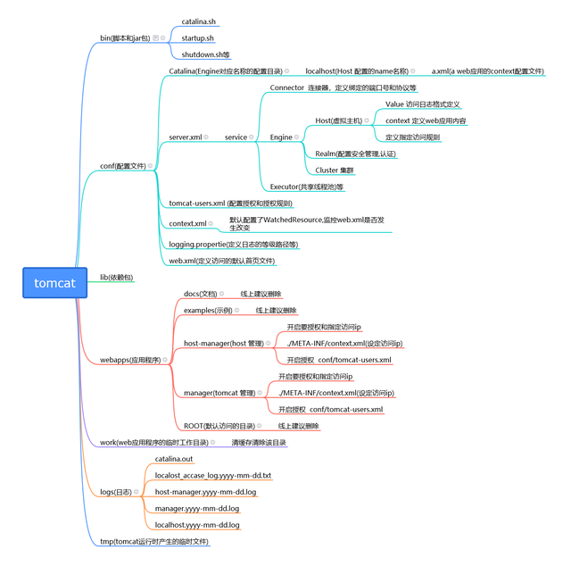

# Tomcat结构

## Tomcat的各个组件
- server: 即服务器，每个tomcat服务器启动后，就是一个server
- service: 这是一种抽象的服务，通常是在日志或者管理时使用这样一个概念。他把连接器和处理引擎结合在一起
- connector: 用于处理连接和并发，通常包含两种方式HTTP和AJP。TTP是用于网页地址栏http这种访问方式；AJP一般用于搭配Apache服务器
- engine: 处理引擎, 所有的请求都是通过处理引擎处理的。
- host: 虚拟主机，用于处理请求的映射处理。每个虚拟主机可以看作独立的请求文件。
- realm: 用于配置安全管理角色，通常读取tomcat-users.xml进行验证。
- context: 上下文，对应于web应用。

组件之间的整体关系，总结如下:
- 一个server元素中可以有一个或多个service元素。
- 一个service可以包含多个connector，但是只能包含一个engine：connector接收请求，engine处理请求。
- engine，host和context都是容器，且engine包含一个或者多个host。
- host包含零个或者多个context，每个host组件代表engine中的一个虚拟主机。
- value，realm可以嵌入在host/engine/context元素内。

## Tomcat目录

## Server.xml配置
\<Server>节点: \<Server port="8005" shutdown="SHUTDOWN">

| 属性        | 描述                                                                                                      | 示例                  |
|:----------|:--------------------------------------------------------------------------------------------------------|:--------------------|
| className | 要使用的Java类名                                                                                              ||
| address   | 服务器等待接收shutdown 命令的地址,默认localhost                                                                       ||
| port      | 接收shutdown命令的端口，设置为-1 为禁用关闭端口，也就是你不能通过这种方式来关闭了,这样就会影响你使用脚本(catalina.sh 或者是shutdown.sh)来stop了，默认绑定8005端口 | port=8085           |
| shutdown  | 指定shutdown 命令的别名,默认值SHUTDOWN                                                                            | shutdown="SHUTDOWN" |

\<Service>节点: \<Service name="Catalina">

| 属性        | 描述                       |
|:----------|:-------------------------|
| className | 要使用的java类名，未指定的话就使用标准的实现 |
| name      | service显示的名称             |

\<Connector>节点: \<Connector port="8080" protocol="HTTP/1.1" maxHttpHeaderSize="409600" connectionTimeout="20000" redirectPort="8443" />

| 参数                      | 含义                                                                                                                 | 示例                              |
|:------------------------|:-------------------------------------------------------------------------------------------------------------------|:--------------------------------|
| port                    | 绑定的端口,如果设置为0，tomcat则随机获取一个空闲端口                                                                                     | 默认 port="8080"                  |
| protocol                | 传输协议和版本                                                                                                            | 默认 protocol = "HTTP/1.1"        |
| connectionTimeout       | 连接超时时间，单位毫秒                                                                                                        | 默认 connectionTimeout="20000"    |
| redirectPort            | 接收到的ssl请求后重定向的端口                                                                                                   | 默认 redirectPort="8443"          |
| maxThreads              | tomcat能创建来处理请求的最大线程数，也为最大并发数 超过则放入请求队列中进行排队，默认值为200；需要根据业务和系统性能进行调整                                                | maxThreads="1000"               |
| URIEncoding             | url的字符编码                                                                                                           | URIEncoding="UTF-8"             |
| minProcessors           | 启动时创建的线程数（最小线程数）                                                                                                   | minProcessors="50"              |
| acceptCount             | 指定当所有可以使用的处理请求的线程数都被使用时，可以放到队列中的请求数，就是被排队的请求数，超过这个数的请求将拒绝连接 默认值为100                                                | acceptcount="500"               |
| acceptorThreadCount     | 可以用于接受连接的进程数，默认为1，但是在一些多核的的服务器上，我们会将它的值设置为2或者更大的数，来应对一些不活跃的连接。                                                     ||
| minSpareThreads         | 最小空闲线程数，任何情况都会存活的线程数，即便超过了最大空闲时间，也不会被回收，默认值10                                                                      | minSpareThreads="25"            |
| maxSpareThreads         | 最大空闲线程数，在最大空闲时间（maxIdleTime）内活跃过，此时空闲，当空闲时间大于maxIdleTime则被回收，小则继续存活，等待被调度，默认值50                                    ||
| enableLookups           | 调用request、getRemoteHost()执行DNS查询，以返回远程主机的主机名，如果设置为false，则直接返回IP地址 默认是禁用的，在请求过滤中的根据远程主机名过滤，需要将该参数设置为true            | enableLookups="false"           |
| maxIdleTime             | 最大空闲时间，超过这个空闲时间，且线程数大于minSpareThreads的，都会被回收，默认值1分钟（60000ms)                                                       | maxPostSize                     |
| address                 | 对于一些具有多个ip的服务器，我们可以通过该参数指定绑定的ip，默认情况下监听所有的地址                                                                       | address="192.168.1.110"         |
| compressibleMimeType    | 该值用来指定哪些文件类型的文件可以进行压缩，默认值为：text/html,text/xml,text/plain,text/css,text/javascript,application/javascript           ||
| compression             | 开启gzip 压缩，可以接受的值是 "off"(禁用压缩),"on"(开启压缩),"force(强制压缩)"，"1-9"(等效于开启压缩，并且设定压缩等级),开启了压缩，也就意味着要占用更多的cpu资源              | compression                     |
| compressionMinSize      | 在compression 参数指定为on后，该参数用来指定压缩的阈值，只有大于该阈值才会被压缩，默认为 2048                                                           ||
| keepAliveTimeout        | 指connector两个HTTP请求直接的等待时间，超过该时间没有接收到第二个HTTP请求就关闭连接，默认是使用connectionTimeout 的值，单位为毫秒                                 ||
| maxConnections          | 在一定时间内可以接受和处理的最大连接数，达到限制后，服务器接受但不处理该链接，但可以存放到acceptCount，该默认值因连接器类型而异。对于NIO和NIO2，默认值为10000。对于APR / native，默认为8192。 ||
| maxCookieCount          | 请求允许的最大cookie 数，值小于0表示无限制，默认值为 200                                                                                 ||
| disableUploadTimeout    | 默认是true ，禁用数据上传超时                                                                                                  ||
| connectionUploadTimeout | 设定数据上传的超时时间，只有在disableUploadTimeout设置为false才生效，单位毫秒                                                                | connectionUploadTimeout="50000" |
| processorCache          | 进程缓冲器，默认值是maxThreads的值,使用好该值可以提升并发请求。                                                                              ||

\<engine>节点: \<Engine name="Catalina" defaultHost="localhost">

| 属性               | 描述                                                        |
|:-----------------|:----------------------------------------------------------|
| className        | 要使用的实现的Java类名。                                            |
| defaultHost      | 默认的主机名                                                    |
| name             | Engine 的名称，在一个server 中使用多个service元素时，必须给每个Engine分配一个唯一的名称 |
| startStopThreads | 启动Host 的线程数，默认为1                                          |

\<host>节点: \<Host name="localhost" appBase="webapps" unpackWARs="true" autoDeploy="true">

| 属性                  | 描述                                                                                                                                                                                                                                                                       |
|:--------------------|:-------------------------------------------------------------------------------------------------------------------------------------------------------------------------------------------------------------------------------------------------------------------------|
| name                | 域名名称，tomcat会将其全部转化为小写，如果你设置的是*.baidu.com,那么你将匹配www.baidu.com admin.baidu.com 等等以baidu.com 结尾的域名。那么只有是符合该域名的条件的请求才能接受。                                                                                                                                                    |
| appBase             | 指的是虚拟主机的应用程序目录，可以是绝对路径，也可以是相对tomcat目录的相对路径，如果未指定将使用默认值"webapps"                                                                                                                                                                                                          |
| unpackWARs          | 默认为true,如果设置为true 表示将web应用程序war包解压，false表示直接从war文件运行。注意点1：如果设置为true,tomcat解压了该应该程序的包，会向该解压缩的包里面添加一个文件(/META-INF/war-tracker),用于在tomcat未运行时检测war文件(注意是war文件而不是解压目录里面的文件)是否更改。如果war文件更改了，则会重新加载。是针对未启动的时候啊，如果是tomcat正常启动的话更改war包的话是会自动重新加载发布的。注意点2： 如果该属性设置为false的话将导致性能下降 |
| autoDeploy          | 指tomcat在运行时是否要定期检查有没有新的应用程序，如果true,tomcat会定期检查appBase 和xmlBase 目录，如果找到了会自动部署的web应用程序，默认为true                                                                                                                                                                             |
| xmlBase             | 指包含该Host部署的应用程序的Context的xml文件路径。可以是绝对路径也可以是相对tomcat目录的相对路径。如果未指定将使用"conf//"                                                                                                                                                                                              |
| createDirs          | 指在tomcat启动的时候将创建appBase和xmlBase定义的目录，默认为true                                                                                                                                                                                                                             |
| className           | 要使用的实现的Java类名，如果没有指定，将使用标准值。                                                                                                                                                                                                                                             |
| deployIgnore        | 这个属性是相对appBase的，foo只能匹配文件或者目录foo，而不能匹配foo.war                                                                                                                                                                                                                            |
| deployOnStartup     | 指tomcat在启动时是否应该自动部署来自该Host的web应用程序，默认为true                                                                                                                                                                                                                               |
| startStopThreads    | 指Host用于启动Context的线程数，默认值为1                                                                                                                                                                                                                                               |
| undeployOldVersions | 在自动部署的情况下，tomcat是否检查旧的未使用的web应用程序，如果找到，将其删除，在autoDeploy为true且本属性为true才生效，默认值为false                                                                                                                                                                                       |
| deployXML           | 如果你不想使用web应用程序的/META-INF/context.xml,你可以将该值设置为false,线上环境也建议设置为false                                                                                                                                                                                                      |
| copyXML             | 该属性的值如果设置为true,会在程序启动时(且xmlBase无该应用程序对应的xml文件)将位于应用程序的/META-INF/context.xml 的文件，复制到xmlBase下，如果有的话是不会复制的，后续是会以xmlBase里的xml的配置为主的，即使应用程序的/META-INF/context.xml更新了，也是不会生效的。默认为false. copyXML的属性要生效的话前提得deployXML 属性为true，否则不生效。                                             |
| workDir             | 指该Host 应用程序要使用的临时目录的路径名，如果在Context中也指定了workDir将替换掉这里的配置，如果未指定，默认为$CATALINA_BASE/work。                                                                                                                                                                                    |

当autoDeploy 为true 时，tomcat 在启动后会监控部署的web应用程序的文件是否改变，根据具体的改变，web应用程序将重新加载或重新部署。重新部署的不会保留用户会话，重新加载的则会保留。

Context 中的docBase 的路径应该在appBase(Host)之外，否则可能会导致部署两次，属性deployIgnore可以避免这种情况。

如果在server.xml 中定义了Context 属性，则应该关闭deployIgnore,和自动部署应用程序。

\<Value>节点

\<context>节点

除了server.xml 外，任何定义Context的文件只能定义一个context 元素

## 额外注明
1. host的虚拟主机名: 就是虚拟主机的域名(可以看出一个单独的机器)，Tomcat通过在请求URL的域名与name中的值进行匹配，用于查找能够处理该请求的虚拟主机。
如果未找到则交给在engine中defaultHost指定的主机处理。
2. 以上example: 修改配置文件中唯一的host的name，那么浏览器通过这个新name将无法访问，这是由于DNS域名无法解析到这个域名，所以无法访问，当在hosts文件下添加
对应的域名解析，则会通过域名解析到本地IP，去连接tomcat，再由于虚拟主机名是这个域名，所以可以访问到这个虚拟主机，但此时访问localhost时，会就访问不到网页，这是由于
我们修改了默认的访问的虚拟主机域名，也就是说除了通过我们修改后的访问域名可以访问，其他都不能访问了(之前是可以访问默认虚拟主机)。
3. server组件: 启动一个server实例(即一个JVM)，监听8005端口以接收shutdown命令。如果一台物理机上启动了多个server实例，必须配置不同的端口。
4. service组件: 主要用于关联一个引擎和与此引擎相关的连接器，每个连接器通过一个特定的端口和协议接收请求并将其转发至关联的引擎进行处理。
5. connector组件: 支持处理不同请求的组件，一个引擎可以有一个或多个连接器，以适应多种请求方式。默认只开启了处理 Http 协议的连接器。如果需要使用其他协议，需要在 Tomcat中配置该协议的连接器。
6. engine组件: Engine 是 Servlet 处理器的一个实例，即 Servlet 引擎，定义在 server.xml 中的 Service 标记中。Engine 需要 defaultHost 属性来为其定义一个接收所有发往非明确定义虚拟主机的请求的 host 组件。
7. host组件: 位于 Engine 容器中用于接收请求并进行相应处理的虚拟主机。通过该容器可以运行 Servlet 或者 JSP 来处理请求。
8. context组件: 是Host的子标签，代表指定一个web应用，它运行在某个指定的虚拟主机上，每个web应用都是一个war文件或文件的目录; server.xml配置中没有配置context属性，默认支持运行多个项目。