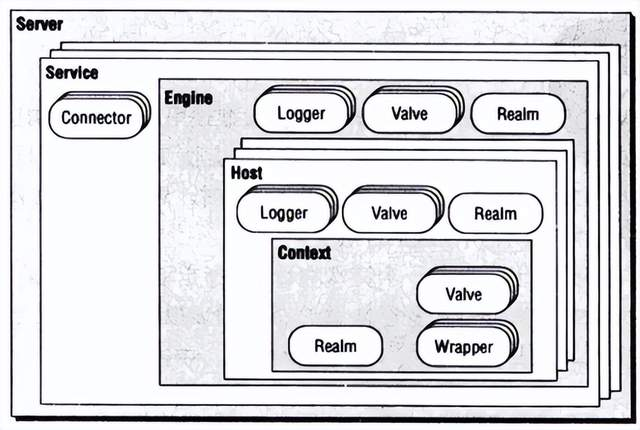
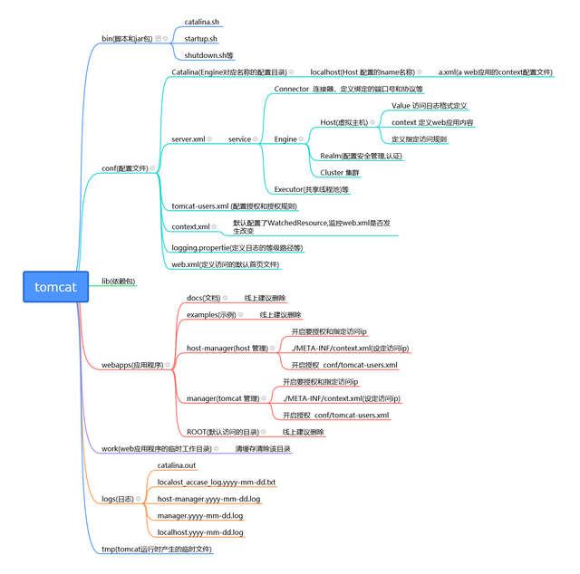
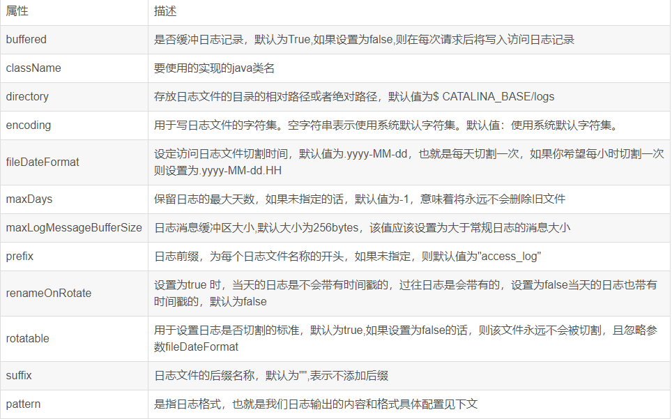
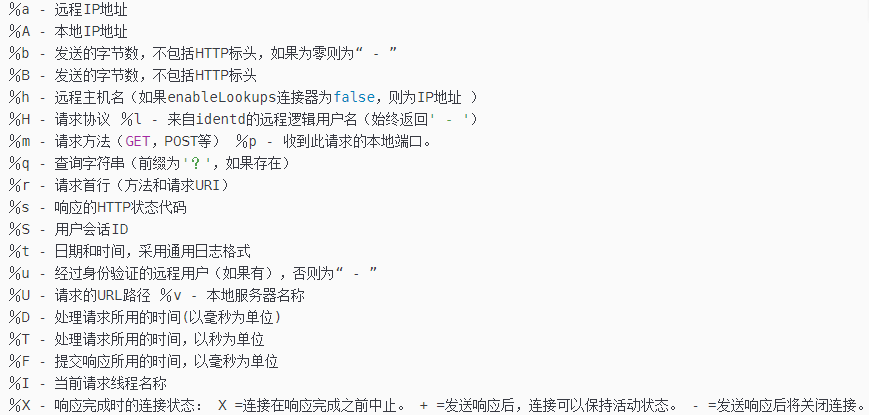
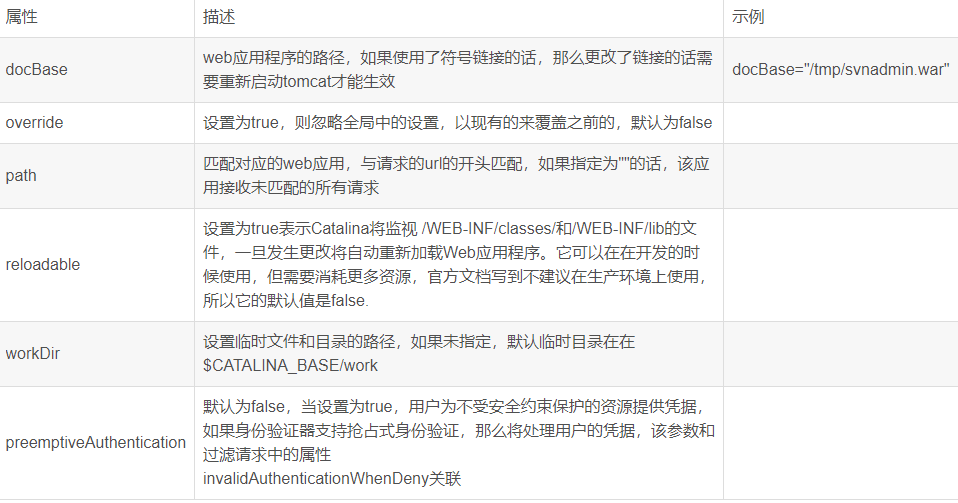

# Tomcat结构

## Tomcat的各个组件
- server: 即服务器，每个tomcat服务器启动后，就是一个server
- service: 这是一种抽象的服务，通常是在日志或者管理时使用这样一个概念。他把连接器和处理引擎结合在一起
- connector: 用于处理连接和并发，通常包含两种方式HTTP和AJP。TTP是用于网页地址栏http这种访问方式；AJP一般用于搭配Apache服务器
- engine: 处理引擎, 所有的请求都是通过处理引擎处理的。
- host: 虚拟主机，用于处理请求的映射处理。每个虚拟主机可以看作独立的请求文件。
- realm: 用于配置安全管理角色，通常读取tomcat-users.xml进行验证。
- context: 上下文，对应于web应用。

组件之间的整体关系，总结如下:
- 一个server元素中可以有一个或多个service元素。
- 一个service可以包含多个connector，但是只能包含一个engine：connector接收请求，engine处理请求。
- engine，host和context都是容器，且engine包含一个或者多个host。
- host包含零个或者多个context，每个host组件代表engine中的一个虚拟主机。
- value，realm可以嵌入在host/engine/context元素内。

## Tomcat目录

## Server.xml配置
\<Server>节点: \<Server port="8005" shutdown="SHUTDOWN">

| 属性        | 描述                                                                                                      | 示例                  |
|:----------|:--------------------------------------------------------------------------------------------------------|:--------------------|
| className | 要使用的Java类名                                                                                              ||
| address   | 服务器等待接收shutdown 命令的地址,默认localhost                                                                       ||
| port      | 接收shutdown命令的端口，设置为-1 为禁用关闭端口，也就是你不能通过这种方式来关闭了,这样就会影响你使用脚本(catalina.sh 或者是shutdown.sh)来stop了，默认绑定8005端口 | port=8085           |
| shutdown  | 指定shutdown 命令的别名,默认值SHUTDOWN                                                                            | shutdown="SHUTDOWN" |

\<Service>节点: \<Service name="Catalina">

| 属性        | 描述                       |
|:----------|:-------------------------|
| className | 要使用的java类名，未指定的话就使用标准的实现 |
| name      | service显示的名称             |

\<Connector>节点: \<Connector port="8080" protocol="HTTP/1.1" maxHttpHeaderSize="409600" connectionTimeout="20000" redirectPort="8443" />

| 参数                      | 含义                                                                                                                 | 示例                              |
|:------------------------|:-------------------------------------------------------------------------------------------------------------------|:--------------------------------|
| port                    | 绑定的端口,如果设置为0，tomcat则随机获取一个空闲端口                                                                                     | 默认 port="8080"                  |
| protocol                | 传输协议和版本                                                                                                            | 默认 protocol = "HTTP/1.1"        |
| connectionTimeout       | 连接超时时间，单位毫秒                                                                                                        | 默认 connectionTimeout="20000"    |
| redirectPort            | 接收到的ssl请求后重定向的端口                                                                                                   | 默认 redirectPort="8443"          |
| maxThreads              | tomcat能创建来处理请求的最大线程数，也为最大并发数 超过则放入请求队列中进行排队，默认值为200；需要根据业务和系统性能进行调整                                                | maxThreads="1000"               |
| URIEncoding             | url的字符编码                                                                                                           | URIEncoding="UTF-8"             |
| minProcessors           | 启动时创建的线程数（最小线程数）                                                                                                   | minProcessors="50"              |
| acceptCount             | 指定当所有可以使用的处理请求的线程数都被使用时，可以放到队列中的请求数，就是被排队的请求数，超过这个数的请求将拒绝连接 默认值为100                                                | acceptcount="500"               |
| acceptorThreadCount     | 可以用于接受连接的进程数，默认为1，但是在一些多核的的服务器上，我们会将它的值设置为2或者更大的数，来应对一些不活跃的连接。                                                     ||
| minSpareThreads         | 最小空闲线程数，任何情况都会存活的线程数，即便超过了最大空闲时间，也不会被回收，默认值10                                                                      | minSpareThreads="25"            |
| maxSpareThreads         | 最大空闲线程数，在最大空闲时间（maxIdleTime）内活跃过，此时空闲，当空闲时间大于maxIdleTime则被回收，小则继续存活，等待被调度，默认值50                                    ||
| enableLookups           | 调用request、getRemoteHost()执行DNS查询，以返回远程主机的主机名，如果设置为false，则直接返回IP地址 默认是禁用的，在请求过滤中的根据远程主机名过滤，需要将该参数设置为true            | enableLookups="false"           |
| maxIdleTime             | 最大空闲时间，超过这个空闲时间，且线程数大于minSpareThreads的，都会被回收，默认值1分钟（60000ms)                                                       | maxPostSize                     |
| address                 | 对于一些具有多个ip的服务器，我们可以通过该参数指定绑定的ip，默认情况下监听所有的地址                                                                       | address="192.168.1.110"         |
| compressibleMimeType    | 该值用来指定哪些文件类型的文件可以进行压缩，默认值为：text/html,text/xml,text/plain,text/css,text/javascript,application/javascript           ||
| compression             | 开启gzip 压缩，可以接受的值是 "off"(禁用压缩),"on"(开启压缩),"force(强制压缩)"，"1-9"(等效于开启压缩，并且设定压缩等级),开启了压缩，也就意味着要占用更多的cpu资源              | compression                     |
| compressionMinSize      | 在compression 参数指定为on后，该参数用来指定压缩的阈值，只有大于该阈值才会被压缩，默认为 2048                                                           ||
| keepAliveTimeout        | 指connector两个HTTP请求直接的等待时间，超过该时间没有接收到第二个HTTP请求就关闭连接，默认是使用connectionTimeout 的值，单位为毫秒                                 ||
| maxConnections          | 在一定时间内可以接受和处理的最大连接数，达到限制后，服务器接受但不处理该链接，但可以存放到acceptCount，该默认值因连接器类型而异。对于NIO和NIO2，默认值为10000。对于APR / native，默认为8192。 ||
| maxCookieCount          | 请求允许的最大cookie 数，值小于0表示无限制，默认值为 200                                                                                 ||
| disableUploadTimeout    | 默认是true ，禁用数据上传超时                                                                                                  ||
| connectionUploadTimeout | 设定数据上传的超时时间，只有在disableUploadTimeout设置为false才生效，单位毫秒                                                                | connectionUploadTimeout="50000" |
| processorCache          | 进程缓冲器，默认值是maxThreads的值,使用好该值可以提升并发请求。                                                                              ||

\<engine>节点: \<Engine name="Catalina" defaultHost="localhost">

| 属性               | 描述                                                        |
|:-----------------|:----------------------------------------------------------|
| className        | 要使用的实现的Java类名。                                            |
| defaultHost      | 默认的主机名                                                    |
| name             | Engine 的名称，在一个server 中使用多个service元素时，必须给每个Engine分配一个唯一的名称 |
| startStopThreads | 启动Host 的线程数，默认为1                                          |

\<host>节点: \<Host name="localhost" appBase="webapps" unpackWARs="true" autoDeploy="true">

| 属性                  | 描述                                                                                                                                                                                                                                                                       |
|:--------------------|:-------------------------------------------------------------------------------------------------------------------------------------------------------------------------------------------------------------------------------------------------------------------------|
| name                | 域名名称，tomcat会将其全部转化为小写，如果你设置的是*.baidu.com,那么你将匹配www.baidu.com admin.baidu.com 等等以baidu.com 结尾的域名。那么只有是符合该域名的条件的请求才能接受。                                                                                                                                                    |
| appBase             | 指的是虚拟主机的应用程序目录，可以是绝对路径，也可以是相对tomcat目录的相对路径，如果未指定将使用默认值"webapps"                                                                                                                                                                                                          |
| unpackWARs          | 默认为true,如果设置为true 表示将web应用程序war包解压，false表示直接从war文件运行。注意点1：如果设置为true,tomcat解压了该应该程序的包，会向该解压缩的包里面添加一个文件(/META-INF/war-tracker),用于在tomcat未运行时检测war文件(注意是war文件而不是解压目录里面的文件)是否更改。如果war文件更改了，则会重新加载。是针对未启动的时候啊，如果是tomcat正常启动的话更改war包的话是会自动重新加载发布的。注意点2： 如果该属性设置为false的话将导致性能下降 |
| autoDeploy          | 指tomcat在运行时是否要定期检查有没有新的应用程序，如果true,tomcat会定期检查appBase 和xmlBase 目录，如果找到了会自动部署的web应用程序，默认为true                                                                                                                                                                             |
| xmlBase             | 指包含该Host部署的应用程序的Context的xml文件路径。可以是绝对路径也可以是相对tomcat目录的相对路径。如果未指定将使用"conf//"                                                                                                                                                                                              |
| createDirs          | 指在tomcat启动的时候将创建appBase和xmlBase定义的目录，默认为true                                                                                                                                                                                                                             |
| className           | 要使用的实现的Java类名，如果没有指定，将使用标准值。                                                                                                                                                                                                                                             |
| deployIgnore        | 这个属性是相对appBase的，foo只能匹配文件或者目录foo，而不能匹配foo.war                                                                                                                                                                                                                            |
| deployOnStartup     | 指tomcat在启动时是否应该自动部署来自该Host的web应用程序，默认为true                                                                                                                                                                                                                               |
| startStopThreads    | 指Host用于启动Context的线程数，默认值为1                                                                                                                                                                                                                                               |
| undeployOldVersions | 在自动部署的情况下，tomcat是否检查旧的未使用的web应用程序，如果找到，将其删除，在autoDeploy为true且本属性为true才生效，默认值为false                                                                                                                                                                                       |
| deployXML           | 如果你不想使用web应用程序的/META-INF/context.xml,你可以将该值设置为false,线上环境也建议设置为false                                                                                                                                                                                                      |
| copyXML             | 该属性的值如果设置为true,会在程序启动时(且xmlBase无该应用程序对应的xml文件)将位于应用程序的/META-INF/context.xml 的文件，复制到xmlBase下，如果有的话是不会复制的，后续是会以xmlBase里的xml的配置为主的，即使应用程序的/META-INF/context.xml更新了，也是不会生效的。默认为false. copyXML的属性要生效的话前提得deployXML 属性为true，否则不生效。                                             |
| workDir             | 指该Host 应用程序要使用的临时目录的路径名，如果在Context中也指定了workDir将替换掉这里的配置，如果未指定，默认为$CATALINA_BASE/work。                                                                                                                                                                                    |

当autoDeploy 为true 时，tomcat 在启动后会监控部署的web应用程序的文件是否改变，根据具体的改变，web应用程序将重新加载或重新部署。重新部署的不会保留用户会话，重新加载的则会保留。

Context 中的docBase 的路径应该在appBase(Host)之外，否则可能会导致部署两次，属性deployIgnore可以避免这种情况。

如果在server.xml 中定义了Context 属性，则应该关闭deployIgnore,和自动部署应用程序。

\<Value>节点

\<context>节点

除了server.xml 外，任何定义Context的文件只能定义一个context 元素