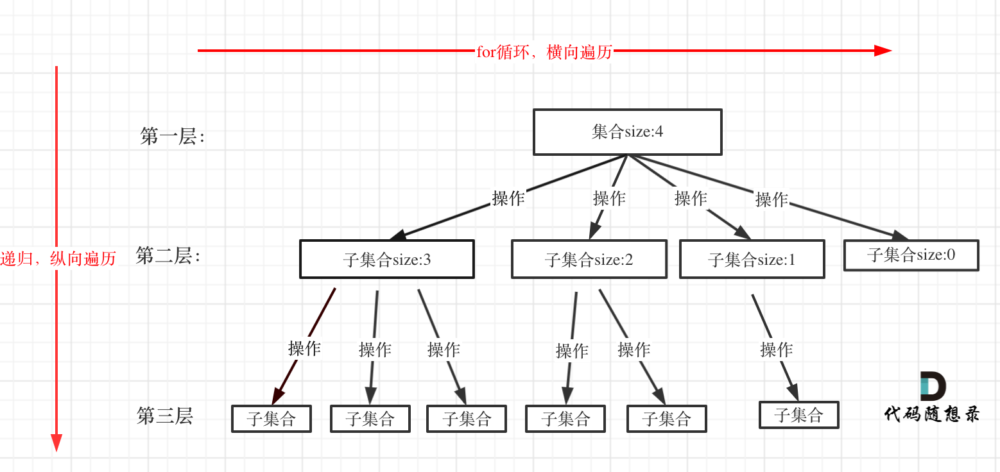

# 回溯算法
## 什么是回溯法
回溯法也可以叫回溯搜索法。它是一种搜索方式。

在二叉树系列中，其实还包含着递归，回溯是递归的副产物，<font color=red>只要有递归就会有回溯</font>。

所以回溯算法也就是递归算法，值得都是一个函数。

## 回溯法的效率
虽然回溯法很难，其不好理解，但是回溯法并不是什么高效的算法。

因为回溯的本质是<font color=red>穷举</font>，穷举所有的可能，然后选出我们想要的答案，如果想让其高效一些，可加一些剪枝操作。

## 回溯法解决的问题
一般可解决如下几种问题: 
- 组合问题: N个数里面按照一定规则找出K个数的集合
- 切割问题: 一个字符按一定规则有几种切割方式
- 子集问题: 一个N个数的集合里面有多少符合条件的子集
- 排列问题: N个数按一定规则全排列，有几种排列的方式
- 棋盘问题: N皇后，解数独等等

其中: 组合不强调元素顺序，排列是强调元素顺序，以上问题实际上都是排列组合问题(树?)

## 如何理解回溯法
<font color=red>回溯法解决的问题都可以抽象为树形结构</font>(还真是)，所有回溯法的问题都可以抽象为树形结构！

因为回溯法解决的都是在集合中递归查找子集，集合的大小构成了树的宽度，递归的深度，都构成树的深度。

递归就要有终止条件，所以必然是一颗高度有限的数(N叉树)。

## 回溯法模版
除了递归三部曲，还有回溯三部曲: 
- 回溯函数模版返回值以及参数(函数返回值一般是void, 函数名一般是backtracking, 参数是先写逻辑，然后需要什么参数, 就填什么参数)
- 回溯函数终止条件，既然是树形结构，那么在遍历树形结构一定要有终止条件，所以从树中可以看出一般来说搜到叶子结点了，也就满足条件的一条答案，把这个答案存放起来，并结束本层递归。
- 回溯搜索的遍历过程, 回溯法一般是在集合中递归搜索，集合的大小构成了树的宽度，递归的深度构成了树的深度。

- 12

## 框架如下
```Code
class algorithm {
    void backtracking(params) {
        if (终止条件) {
            存放结果;
            return;
        }
        for (选择: 本层集合中元素(树中结点孩子的数量就是集合大小)) {
            处理结点;
            backtracking(路径, 选择列表);
            回溯,撤销处理结果
        }
    }
}
```